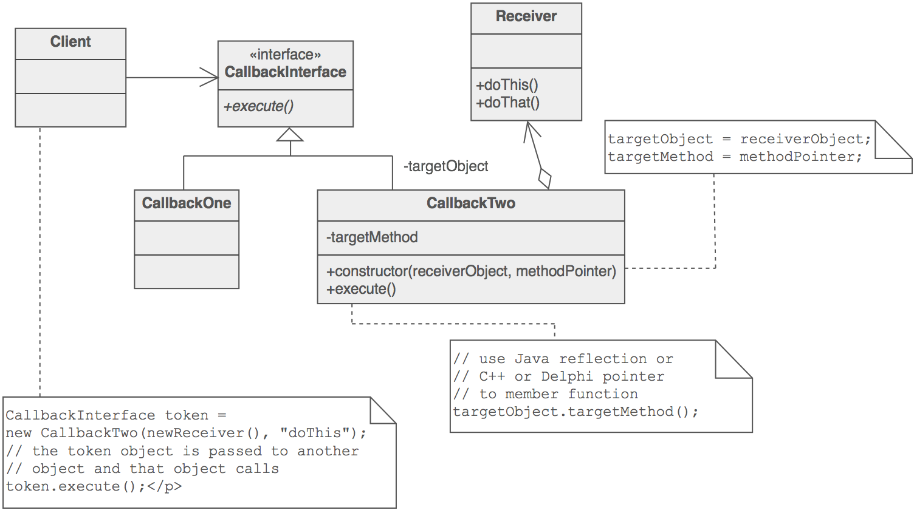

# Behavioral Design Patterns 
## Command

### Кратко описание

Command капсулира дадена заявка във вид на обект. Това позволява свързването на клиента с различни заявки или опашки, както и поддръжка на функция за връщане на промените (undo).

### Намерение:
- капсулиране на искане в обект
- Позволява параметризиране на клиенти с различни искания
- Позволява запазване на исканията в опашка

### Имплементация

###### Command example

	using System;

    class MainApp
    {
    	static void Main()
    	{
      		// Create receiver, command, and invoker 
      		Receiver receiver = new Receiver();
      		Command command = new ConcreteCommand(receiver);
      		Invoker invoker = new Invoker();

      		// Set and execute command 
      		invoker.SetCommand(command);
      		invoker.ExecuteCommand();

      		// Wait for user 
      		Console.Read();
    	}
    }

###### Abstract Command

    abstract class Command 
    {
    	protected Receiver receiver;

    	// Constructor 
    	public Command(Receiver receiver)
    	{
      		this.receiver = receiver;
    	}

    	public abstract void Execute();
    }

###### Concrete Command

    class ConcreteCommand : Command
    {
    	// Constructor 
    	public ConcreteCommand(Receiver receiver) : 
      	base(receiver) 
    	{  
    	}

    	public override void Execute()
    	{
      		receiver.Action();
    	}
    }

###### Receiver
    
    class Receiver 
    {
    	public void Action()
    	{
      		Console.WriteLine("Called Receiver.Action()");
    	}
    }

###### Invoker

	class Invoker 
    {
    	private Command command;

    	public void SetCommand(Command command)
    	{
      		this.command = command;
    	}

    	public void ExecuteCommand()
    	{
      		command.Execute();
    	}    
    }

### UML Диаграма

