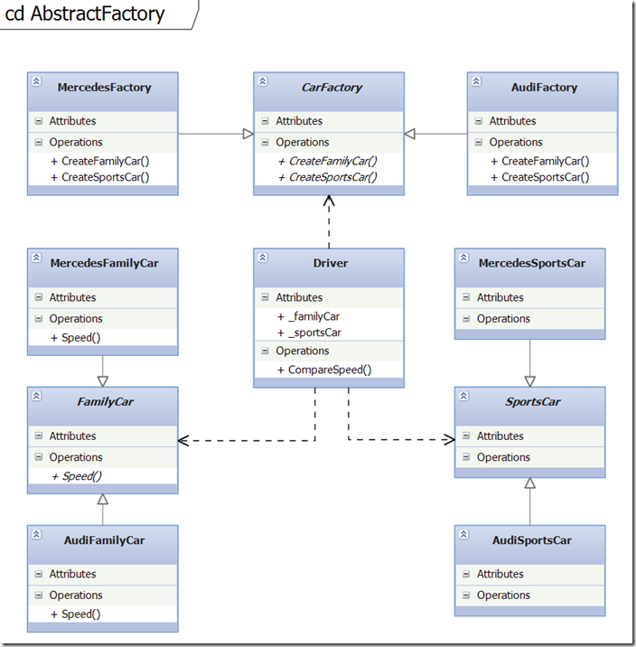

# Creational Design Patterns 
### Abstract Factory

## Кратко описание
"The Gang of Four" казват, че предназначението на  Abstract Factory е: "да предостави интерфейс за създаване на семейства на свързани или зависими обекти, без да уточнява техните конкретни класове."

Abstract Factory е с едно ниво на абстракция по-високо от Simple Factory. Класът на абстрактната фабрика дефинира абстрактни методи, които трябва да бъдат имплементирани в класовете на конкретните фабрики. Можем да използваме Abstract Factory, когато искаме да връщаме обекти от един от няколко свързани класа, всеки от които може да върне няколко различни обекти при поискване.  

Едно от големите предимства на Abstract Factory е, че можем да добавяме нови подкласове много лесно.
Не трябва да се променя съществуващия код, а само да се добавя нов.

## Имплементация

###### Car Factory

	public abstract class CarFactory
    {
        public abstract SportsCar CreateSportsCar();
        public abstract FamilyCar CreateFamilyCar();
    }
 
    public class AudiFactory : CarFactory
    {
        public override SportsCar CreateSportsCar()
        {
            return new AudiSportsCar();
        }
 
        public override FamilyCar CreateFamilyCar()
        {
            return new AudiFamilyCar();
        }
    }
 
    public class MercedesFactory : CarFactory
    {
        public override SportsCar CreateSportsCar()
        {
            return new MercedesSportsCar();
        }
 
        public override FamilyCar CreateFamilyCar()
        {
            return new MercedesFamilyCar();
        }
    }

###### Abstract car

    public abstract class SportsCar
    {
    }
 
    public abstract class FamilyCar
    {
        public abstract void Speed(SportsCar abstractFamilyCar);
    }
 
    class MercedesSportsCar : SportsCar
    {
    }
    
    class MercedesFamilyCar : FamilyCar
    {
        public override void Speed(SportsCar abstractSportsCar)
        {
            Console.WriteLine(GetType().Name + " is slower than " + abstractSportsCar.GetType().Name);
        }
    }
 
    class AudiSportsCar : SportsCar
    {
    }
 
    class AudiFamilyCar : FamilyCar
    {
        public override void Speed(SportsCar abstractSportsCar)
        {
            Console.WriteLine(GetType().Name + " is slower than " + abstractSportsCar.GetType().Name);
        }
    }

###### Driver

    public class Driver
    {
        private CarFactory carFactory;
        private SportsCar sportsCar;
        private FamilyCar familyCar;
 
        public Driver(CarFactory carFactory)
        {
            CarFactory = carFactory;
            SportsCar = CarFactory.CreateSportsCar();
            FamilyCar = CarFactory.CreateFamilyCar();
        }
 
        private CarFactory CarFactory
        {
            get { return carFactory; }
            set { carFactory = value; } 
        }
 
        private SportsCar SportsCar
        {
            get { return sportsCar; }
            set { sportsCar = value; } 
        }
 
        private FamilyCar FamilyCar
        {
            get { return familyCar; }
            set { familyCar = value; } 
        }
 
        public void CompareSpeed()
        {
            FamilyCar.Speed(SportsCar);
        }
    }

###### UML Диаграма

