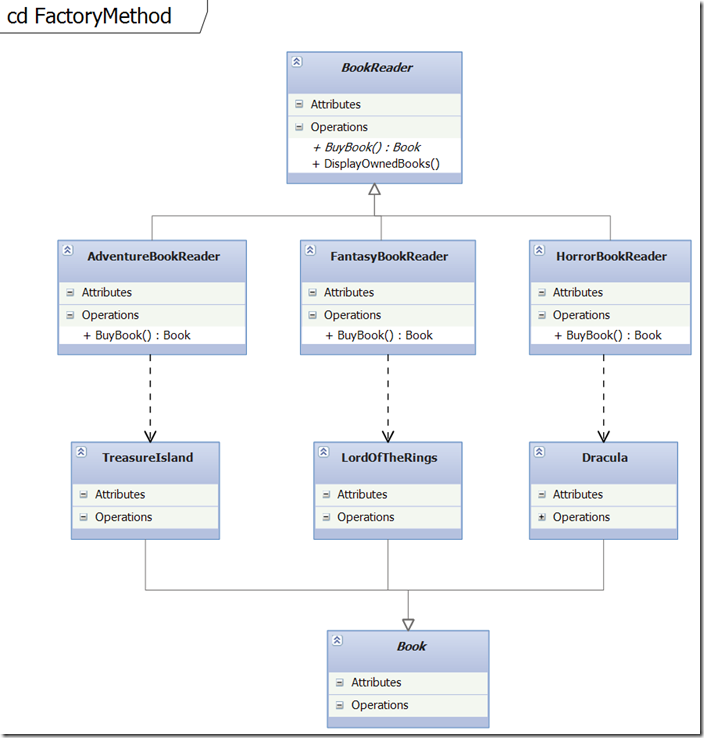

# Creational Design Patterns 
### Factory Method

## Кратко описание

Factory method дефинира интерфейс за създаване на обект, но оставя субкласовете да решат, кой клас да инстантират.
Абстрактният creator имплементира factory method, който връща обекти.
Всеки конкретен creator оверрайдва абстрактния factory method и връща конкретен обект в зависимост от контекста.
В този пример factory method се използва вътрешно с property, но може да се използва и във външен контекст за създаване на обекти, когато е необходимо.

## Имплементация

###### Book Reader

	 public abstract class BookReader
    {
        public BookReader()
        {
            Book = BuyBook();
        }
 
        public Book Book { get; set; }
 
        public abstract Book BuyBook();

        
        public void DisplayOwnedBooks()
        {
            Console.WriteLine(Book.GetType().ToString());
        }
    }
 
    public class HorrorBookReader : BookReader
    {
        public override Book BuyBook()
        {
            return new Dracula();
        }
    }
 
    public class FantasyBookReader : BookReader
    {
        public override Book BuyBook()
        {
            return new LordOfTheRings();
        }
    }
 
    public class AdventureBookReader : BookReader
    {
        public override Book BuyBook()
        {
            return new TreasureIsland();
        }
    }

###### Books

    public abstract class Book
    {
    }
 
    public class Dracula : Book
    {
    }
 
    public class LordOfTheRings : Book
    {
    }
 
    public class TreasureIsland : Book
    {
    }
 
    public class Encyclopedia : Book
    {
    }

###### Factory Method

    private static void FactoryMethod()
    {
        var bookReaderList = new List<BookReader>();
 
        bookReaderList.Add(new AdventureBookReader());
        bookReaderList.Add(new FantasyBookReader());
        bookReaderList.Add(new HorrorBookReader());
 
        foreach (var reader in bookReaderList)
        {
            Console.WriteLine(reader.GetType() .ToString());
            // language agnostic solution
            reader.DisplayOwnedBooks();
 
            Console.WriteLine();
        }
 
        // C# specific solution using generics
        var genericReader = new AdventureBookReader();
        Book book = genericReader.BuyBook<Encyclopedia>();
        Console.WriteLine(book.GetType().ToString());
 
        Console.ReadKey();
    }

###### UML Диаграма

