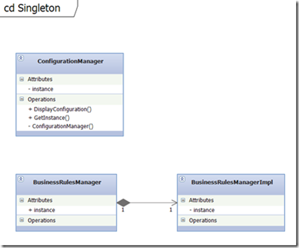

# Creational Design Patterns 
### Singleton

## Кратко описание

Има няколко начина за имплементиране на Singleton Pattern в C#. Тук ще разгледаме имплементация, която е thread safety.
Конструкторът е дефиниран като private, така че не е възможно да се инстанцира обектът отвън.
Класът също е маркиран като sealed, което означава, че не се допуска наследство за него.
Вътрешната инстанция на обекта се съхранява в private променлива, която е маркирана като static.
Public static property GetInstance се използва за осигуряване на достъп до този обект.
Тук се съдържа бизнес логиката, така че може да съществува само една единствена инстанция.
За да се постигне това поведение се използва lock стратегия за заключване, за да се гарантира, че само една нишка е позволено да направи null check и да се създаде нова инстанция, ако тя все още не съществува.

## Имплементация

###### Configuration Manager

	public sealed class ConfigurationManager
    {
        private static ConfigurationManager instance;
        private static object syncRoot = new Object();
 
        private ConfigurationManager() 
        { 
        
        }
 
        public static ConfigurationManager GetInstance
        {
            get
            {
                lock (syncRoot)
                {
                    if (instance == null)
                    {
                        instance = new ConfigurationManager();
                    }
                }
 
                return instance;
            }
        }
 
        public void DisplayConfiguration()
        {
            Console.WriteLine("Single instance object");
        }
    }

###### Business Rules Manager

    public sealed class BusinessRulesManager
    {
        private BusinessRulesManager()
        {
 
        }
 
        public static BusinessRulesManager GetInstance
        {
            get
            {
                return BusinessRulesManagerImpl.instance;
            }
        }
 
        public void DisplayRules()
        {
            Console.WriteLine("Single instance object");
        }
 
        private class BusinessRulesManagerImpl
        {
            static BusinessRulesManagerImpl()
            {
 
            }
 
            internal static readonly BusinessRulesManager instance = new BusinessRulesManager();
        }
    }

###### Singleton

    private static void Singleton()
    {
        var configurationManager = ConfigurationManager.GetInstance;
        configurationManager.DisplayConfiguration();
 
        var businessRulesManager = BusinessRulesManager.GetInstance;
        businessRulesManager.DisplayRules();
 
        Console.ReadKey();
    }

###### UML Диаграма

